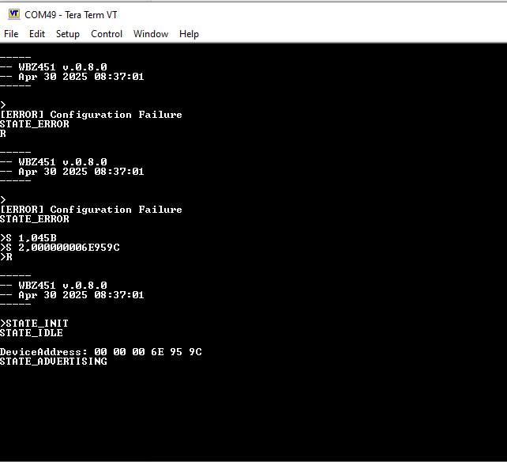
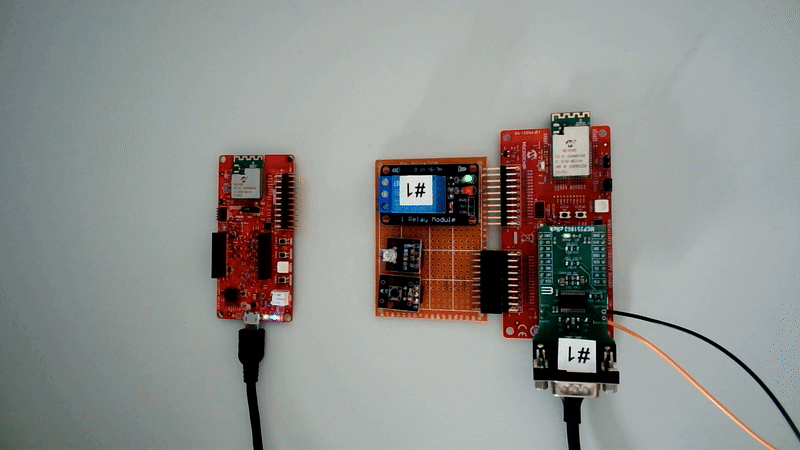

# PIC32CXBZx_WBZx51_BLE_HANDOVER_CAN


> "IoT Made Easy!" - This application demonstrates Seamless Connection Switching in Bluetooth&reg; LE Applications (aka BLE Handover)
 
Devices: **| WBZ351 | WBZ451H | SAME54 Xpro |**  
Features: **| BLE |**

## ⚠ Disclaimer

**THE SOFTWARE ARE PROVIDED "AS IS" AND GIVE A PATH FOR SELF-SUPPORT AND SELF-MAINTENANCE. This repository contains example code intended to help accelerate client product development.**

**For additional Microchip repos, see: [https://github.com/Microchip-MPLAB-Harmony](https://github.com/Microchip-MPLAB-Harmony)**

**Checkout the [Technical support portal](https://microchipsupport.force.com/s/) to access our knowledge base, community forums or submit support ticket requests.**

## Description

The following application demonstrates the 'Seamless Connection Switching in Bluetooth&reg; Applications' feature. This features is also known as 'BLE Handover'.

## Introduction
By connecting 4 devices via Bluetooth&reg; LE to a smartphone for control and monitoring purposes, you can manage multiple connections (connect/disconnect) efficiently. However, it is often better to maintain a single connection for controlling and monitoring all devices to ensure a stable and uninterrupted connection. 

This approach offers several benefits, including the 
- ability to control your application using Bluetooth® LE, 
- always being connected to the 'best' device, and 
- achieving a stable and uninterrupted connection. 
- Additionally, this solution is purely software-based, requiring no changes to the mobile device
<image src="images/ConceptOfSeamlessConnectionSwitching.gif"/>

## Bill of materials
The demo consists of 
- 1 Central Device
   - Smartphone or 
   - 1 __WBZ351__ - PIC32CX-BZ3 and WBZ35x Curiosity Board ([EV19J06A](https://www.microchip.com/en-us/development-tool/EV19J06A))
- 1 Peripheral Device
  - Host Controller:
    - 1 __SAME54 Xplained Pro__ - SAM E54 XPLAINED PRO EVALUATION KIT ([ATSAME54-XPRO](https://www.microchip.com/en-us/development-tool/atsame54-xpro))
  - Peripheral Nodes:
    - 4 __WBZ451H__ - WBZ451HPE Curiosity Board ([EV79Y91A](https://www.microchip.com/en-us/development-tool/EV79Y91A))
    - 4 __MCP251863 CLICK__ Boards ([MIKROE-4955](https://www.mikroe.com/mcp251863-click))
- 1 CAN Sniffer (optional):
  - 1 __SAME54 Xplained Pro__ - SAM E54 XPLAINED PRO EVALUATION KIT ([ATSAME54-XPRO](https://www.microchip.com/en-us/development-tool/atsame54-xpro))

## Software Setup
The PIC32CXBZx_WBZx51_BLE_HANDOVER_CAN package consists of the following applications
- WBZ451HPE based Peripheral Node Application - [apps/001_peripheral](apps/001_peripheral/README.md)
- SAME54 Xplained Pro based Host Controller Application - [apps/002_host](apps/002_host/README.md)
- WBZ351 based Central Device Application - [apps/003_central](apps/003_central/README.md)
- CAN Sniffer for Debugging/Logging - [apps/004_sniffer](apps/004_sniffer/README.md)
- Smartphone App - [Microchip Bluetooth Data](https://play.google.com/store/apps/details?id=com.microchip.bluetooth.data&hl=gsw)

## Hardware Setup
### Block Diagram
<image src="images/blockdiagram.png"/>

#### Modifications on WBZ451HPE Curiosity Board

##### Top Side 
- Remove R94 to disable RGB_LED_GREEN
- Remove R95 to disable RGB_LED_BLUE
- Remove R169 to disable USR_BTN
  
<image src="images/modifications_wbz451hpe_curiosity_board_top.png" width="500"/>

##### Bottom Side
- Remove R120 to use USER_LED

<image src="images/modifcations_wbz451hpe_curiosity_board_bottom.png" width="500"/>

#### Modifications on MCP251863 CLICK Board
- Remove R2(CANL) and R3(CANH) on Peripheral Nodes #1, #2 and #3

<image src="images/modifications_mcp251863_click.png" width="300"/>

#### BLE Extension Board
<image src="images/extension_board_wiring.png" width="500"/>

| Peripheral    | Pin on WBZ451HPE
|--             |--
| LED_GREEN     | PA0 (EXT1 #10)
| LED_RED       | PA1 (EXT1 #8)
| LED_BLUE      | PB12 (EXT1 #5)
| DOOR_HANDLE   | PA7 (EXT1 #11)
| RELAY         | PA8 (EXT1 #12)
| VCC           | EXT1/2 #20, mikroBus #7
| GND           | EXT1/2 #19, mikroBus #8, #9

<image src="images/wbz451hpe_ext1.png" width="400"/>


## Board Programming

Use MPLAB IPE for programming the following hex files
- Central Device
   - __WBZ351__ ([WBZ351_CentralDevice.hex](hex/WBZ351_CentralDevice.hex))
- Peripheral Device
  - Host Controller:
    - __SAME54 Xplained Pro__ ([SAME54_XPRO_Host.hex](hex/SAME54_XPRO_Host.hex))
  - Peripheral Nodes:
    - __WBZ451H__ ([WBZ451HPE_PeripheralDevice.hex](hex/WBZ451HPE_PeripheralDevice.hex))
    
- CAN Sniffer (optional):
  - __SAME54 Xplained Pro__ ([SAME54_XPRO_CANSniffer.hex](hex/SAME54_XPRO_CANSniffer.hex))

## Configuration
After programming the nodes are not configured correctly for the demo and enter error state after reset.
To configure the node correctly following commands shall be send via virtual com port to the WBZ451HPE Node.

Following parameters needs to be configured
- CAN address
  - Node #1: 0x045B
  - Node #2: 0x045C
  - Node #3: 0x045D
  - Node #4: 0x045E

BLE address (1 common BLE address for all nodes '000000006E959C')

### Serial Port Configuration

<image src="images/serial_port_setting_configuration.png"/>

#### Node #1 Sequence
```
>R
>S 1,045B
>S 2,000000006E959C
>R
```
#### Node #2 Sequence
```
>R
>S 1,045C
>S 2,000000006E959C
>R
```
#### Node #3 Sequence
```
>R
>S 1,045D
>S 2,000000006E959C
>R
```
#### Node #4 Sequence
```
>R
>S 1,045E
>S 2,000000006E959C
>R
```



__Note:__  
The 'R' command is the reset command and sets the device in a predefined state. The device remains in error state until configuration (CAN address and BLE address) is completed. If configuration is complete, the device starts in advertising mode after reset.


### LED Signalling
Following LEDs are available for signalling
WBZ451HPE
- Blue User LED
- Red RGB LED

BLE Handover Extension
- Red RGB LED
- Green RGB LED
- Blue RGB LED


The BLE Nodes indicates their current application state via following LED Pattern (10 slots 100ms each)

#### Initialization State 'STATE_INIT'
<image src="images/led_signaling_state_init.png"/>

#### Idle State 'STATE_IDLE'
<image src="images/led_signaling_state_idle.png"/>

#### Advertising State 'STATE_ADVERTISING'
<image src="images/led_signaling_state_advertising.png"/>

#### Active Connected State 'STATE_ACTIVE_CONNECTED'
<image src="images/led_signaling_state_active_connected.png"/>

#### Passive Connected State 'STATE_PASSIVE_CONNECTED'
<image src="images/led_signaling_state_passive_connected.png"/>

#### Disconnected State 'STATE_DISCONNECTED'
<image src="images/led_signaling_state_disconnected.png"/>

#### Error State 'STATE_ERROR'
<image src="images/led_signaling_state_error.png"/>

#### Debug State 'STATE_DEBUG
<image src="images/led_signaling_state_debug.png"/>

## Run the demo
### Using smartphone acting as the Bluetooth&reg; LE key
1. Open Microchip Bluetooth Data
2. Select BLE Smart
3. Search in BLE Devices for "_Handover" and select the device
4. Press Connect

Smartphone is now connected with peripheral devices


### Using WBZ351 board acting as the Bluetooth&reg; LE key
1. Wake up WBZ351 via button SW2
2. Blinking LED on WBZ351 signals scanning in progress
3. LED permanent on on WBZ351 signals connected
4. Disconnect and Switch OFf WBZ351 by pressing button SW2 again



## Links
- SAM E54 XPLAINED PRO EVALUATION KIT
  - SAM E54 Xplained Pro Users Guide [PDF](https://ww1.microchip.com/downloads/aemDocuments/documents/OTH/ProductDocuments/UserGuides/70005321A.pdf) | [HTML](https://onlinedocs.microchip.com/g/GUID-AA358083-AEED-4BA8-8511-9F986D3390A5)
  - SAM E54 Xplained Pro Design Documentation (New Red PCB) [ZIP](https://ww1.microchip.com/downloads/aemDocuments/documents/OTH/ProductDocuments/BoardDesignFiles/SAM-E54-Xplained-Pro-Design-Documentation-Rev11.zip)
- WBZ451 HPE Curiosity Boards
    -PIC32CX-BZ2 and WBZ451 Family Data Sheet [PDF](https://ww1.microchip.com/downloads/aemDocuments/documents/WSG/ProductDocuments/DataSheets/PIC32CX-BZ2-and-WBZ45-Family-Data-Sheet-DS70005504.pdf) | [HTML](https://onlinedocs.microchip.com/g/GUID-BF0CC5BA-1C78-4CCE-9C55-E847CB1F91C0)
    - WBZ451HPE Curiosity Board Users Guide [PDF](https://ww1.microchip.com/downloads/aemDocuments/documents/WSG/ProductDocuments/UserGuides/WBZ451HPE-Curiosity-Board-User-Guide-DS50003681.pdf) | [HTML](https://onlinedocs.microchip.com/g/GUID-4234C46A-4E1B-4F32-A97B-06C0224652ED)
- MCP251863 CLICK
    - [MCP251863 click schematic](https://download.mikroe.com/documents/add-on-boards/click/MCP251863_click/MCP251863_click_v101_Schematic.PDF)
    - [MCP251863 click datasheet](https://download.mikroe.com/documents/datasheets/MCP251863_Datasheet.pdf)


[Back to top](#pic32cxbzx_wbzx51_ble_handover_can)
