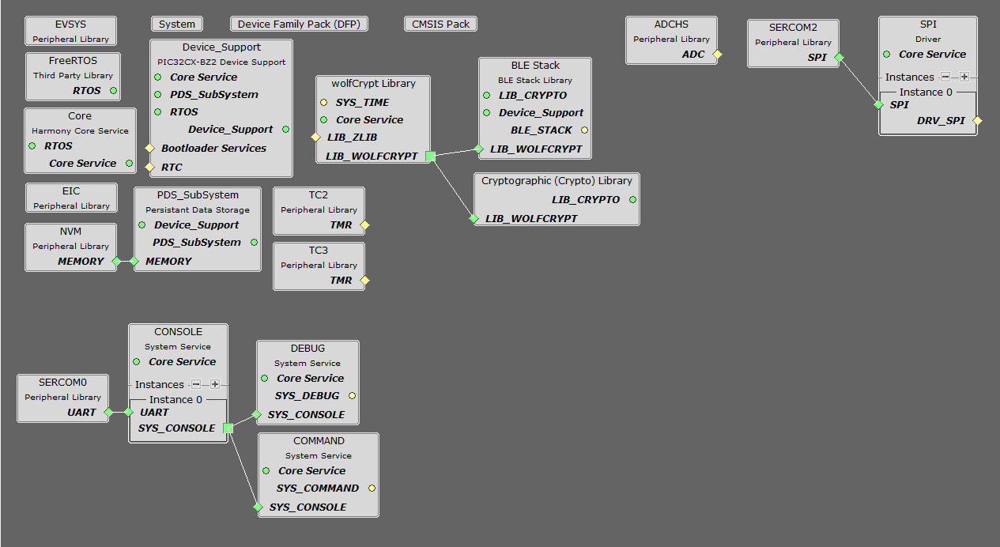
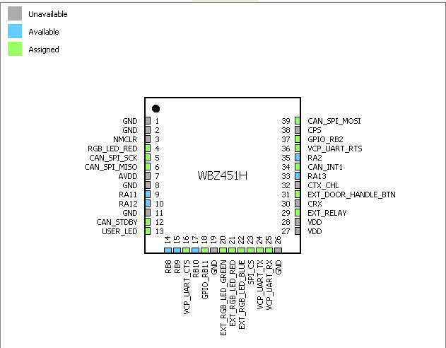
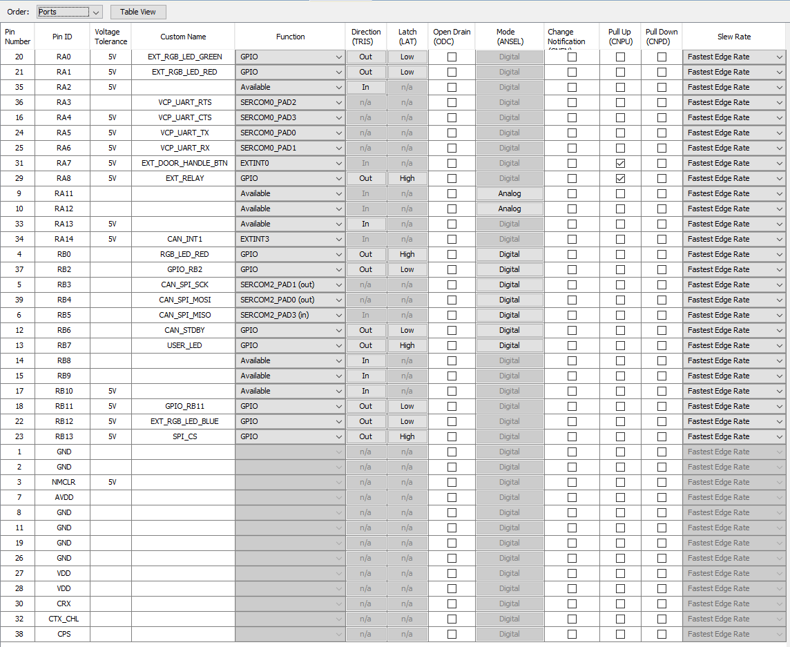
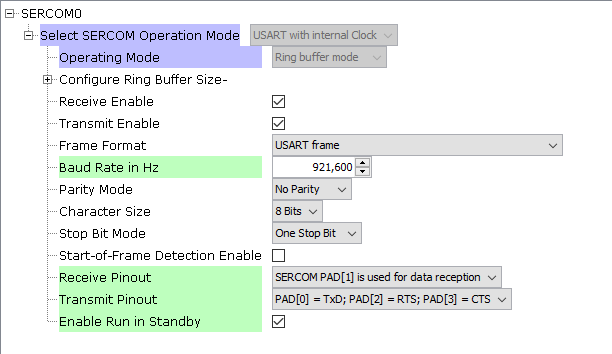
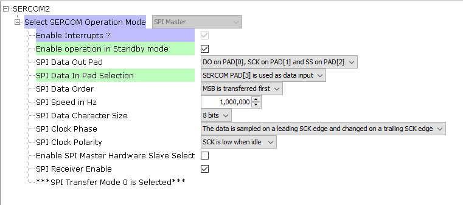

# Peripheral Node Application (apps/001_peripheral)

## Setup

The Peripheral Node application is implemented on a WBZ451HPE.  
The MPLAB&reg; X IDE Project can be found under [apps/001_peripheral/firmware/WBZ451HPE.X](firmware/WBZ451HPE.X)  
The Hex file is available under [hex/WBZ451HPE_PeripheralDevice.hex](../../hex/WBZ451HPE_PeripheralDevice.hex)

The software has been created and tested with the following Software Development Tools:
- [MPLAB&reg; X IDE 6.25](https://www.microchip.com/en-us/development-tools-tools-and-software/mplab-x-ide)
- [MPLAB&reg; XC32 v4.60](https://www.microchip.com/en-us/development-tools-tools-and-software/mplab-xc-compilers)
- [MPLAB&reg; Code Configurator v5.5.1](https://www.microchip.com/en-us/tools-resources/configure/mplab-code-configurator)
  - [csp v3.19.7](https://github.com/Microchip-MPLAB-Harmony/csp/tree/v3.19.7)
  - [wireless_pic32cxbz_wbz v1.4.0](https://github.com/Microchip-MPLAB-Harmony/wireless_pic32cxbz_wbz/tree/v1.4.0)
  - [core v3.13.5](https://github.com/Microchip-MPLAB-Harmony/core/tree/v3.13.5)
  - [wireless_ble v1.3.0](https://github.com/Microchip-MPLAB-Harmony/wireless_ble/tree/v1.3.0)
  - [CMSIS_5 5.9.0](https://github.com/Microchip-MPLAB-Harmony/wireless_ble/tree/v1.3.0)
  - [wolfssl v5.4.0](https://github.com/Microchip-MPLAB-Harmony/wolfssl/tree/v5.4.0)
  - [crypto v3.8.2](https://github.com/Microchip-MPLAB-Harmony/crypto/tree/v3.8.2)
  - [CMSIS-FreeRTOS v10.5.1](https://github.com/Microchip-MPLAB-Harmony/CMSIS-FreeRTOS/tree/v10.5.1)
- Packs:
  - [PIC32CX-BZ_DFP v1.4.243](https://packs.download.microchip.com/)

## Harmony Configuration
### Project Graph

### Pin Diagram and Settings
  

### USART Setting (for configuration and debug purpose)

### SPI Setting (for CAN communication)

[back](../../README.md/#software-setup)