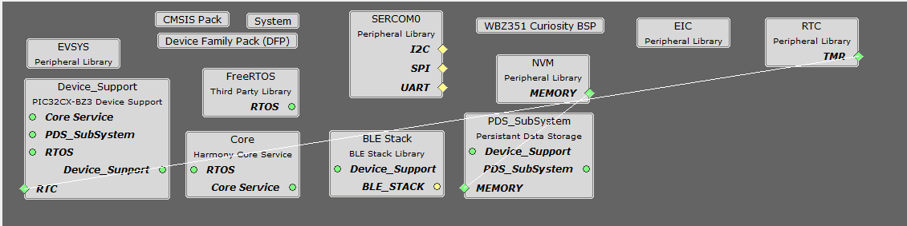
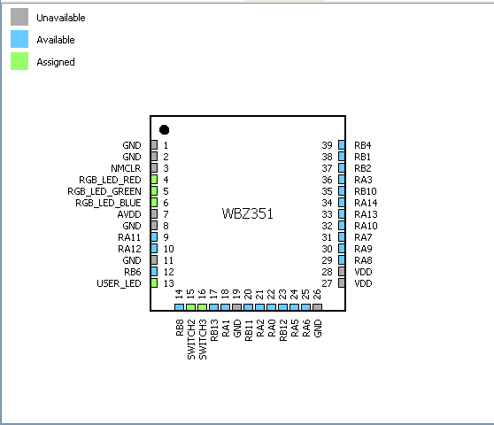
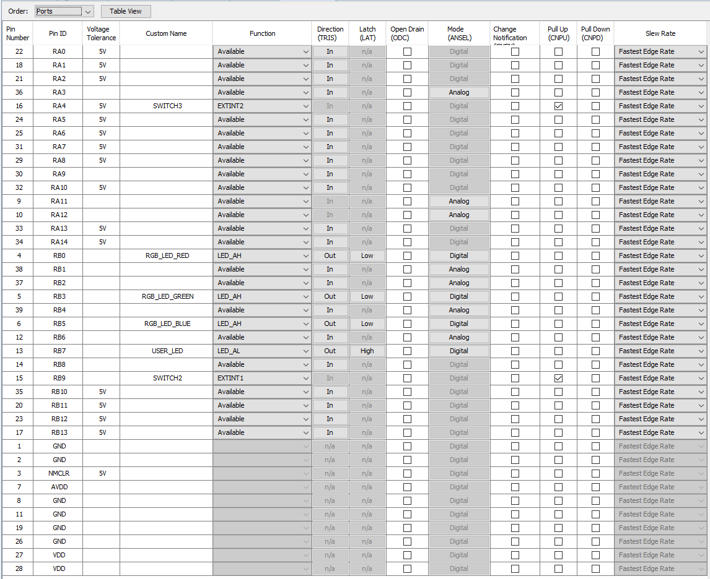

# Central Device Application (003_central)

## Setup

The Central Device application is implemented on a WBZ351.  
The MPLAB&reg; X IDE Project can be found under [apps/003_central/firmware/central_conn.X](firmware/central_conn.X)  
The Hex file is available under [hex/WBZ451HPE_PeripheralDevice.hex](../../hex/WBZ351_CentralDevice.hex)

The software has been created and tested with the following Software Development Tools:
- [MPLAB&reg; X IDE 6.25](https://www.microchip.com/en-us/development-tools-tools-and-software/mplab-x-ide)
- [MPLAB&reg; XC32 v4.60](https://www.microchip.com/en-us/development-tools-tools-and-software/mplab-xc-compilers)
- [MPLAB&reg; Code Configurator v5.5.2](https://www.microchip.com/en-us/tools-resources/configure/mplab-code-configurator)
  - [wireless_pic32cxbz_wbz v1.4.0](https://github.com/Microchip-MPLAB-Harmony/wireless_pic32cxbz_wbz/tree/v1.4.0)
  - [csp v3.19.1](https://github.com/Microchip-MPLAB-Harmony/csp/tree/v3.19.1)
  - [core v3.13.4](https://github.com/Microchip-MPLAB-Harmony/core/tree/v3.13.4)
  - [wireless_ble v1.3.0](https://github.com/Microchip-MPLAB-Harmony/wireless_ble/tree/v1.3.0)
  - [dev_packs v3.18.1](https://github.com/Microchip-MPLAB-Harmony/dev_packs/tree/v3.18.1)
  - [bsp v3.22.0](https://github.com/Microchip-MPLAB-Harmony/bsp/tree/v3.22.0)
  - [CMSIS-FreeRTOS v10.5.1](https://github.com/Microchip-MPLAB-Harmony/CMSIS-FreeRTOS/tree/v10.5.1)

    
## Harmony Configuration
### Project Graph

### Pin Diagram and Settings
  

[back](../../README.md/#software-setup)
