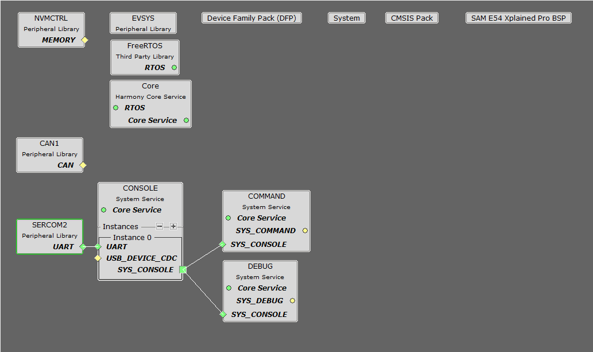
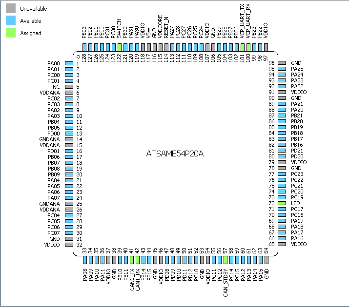
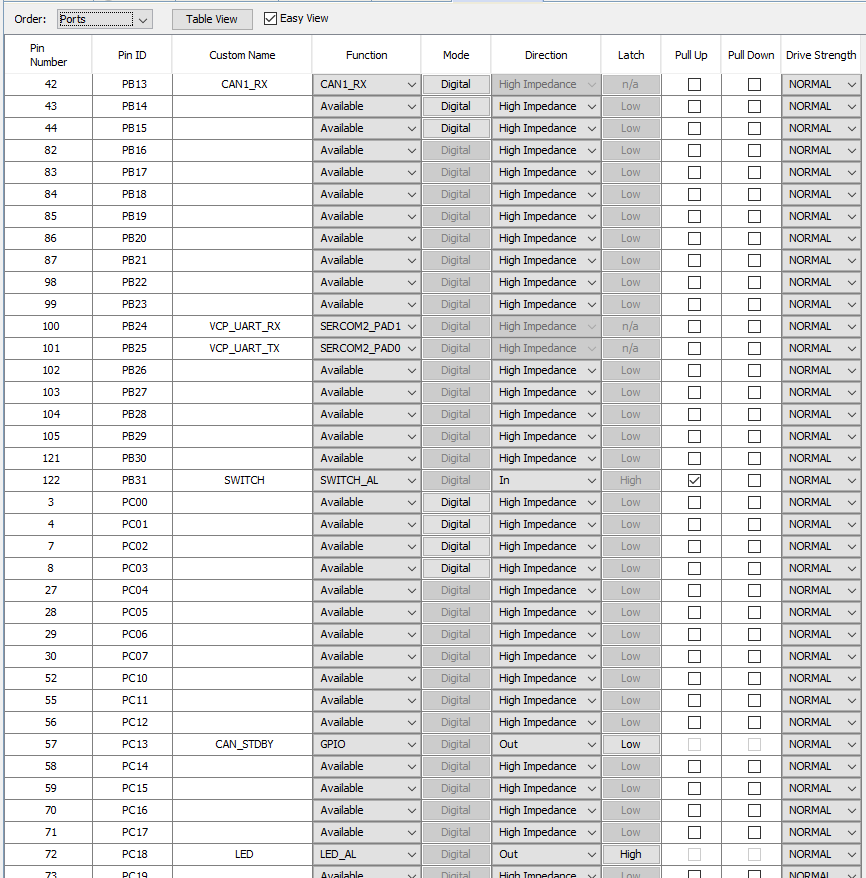
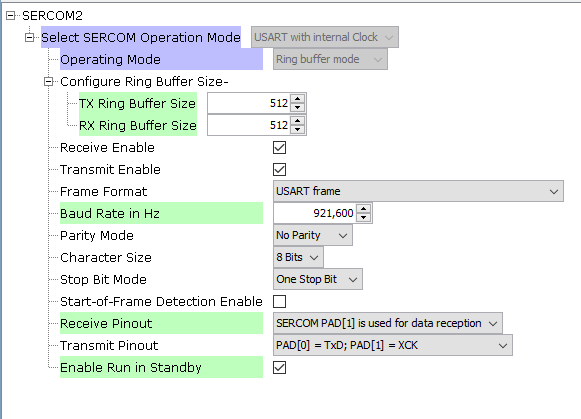
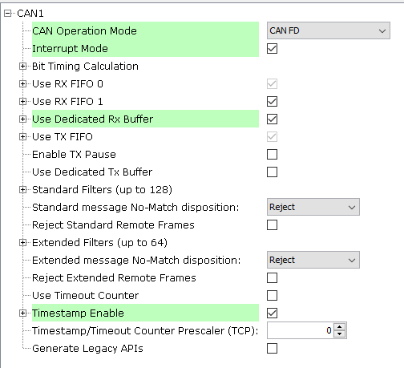
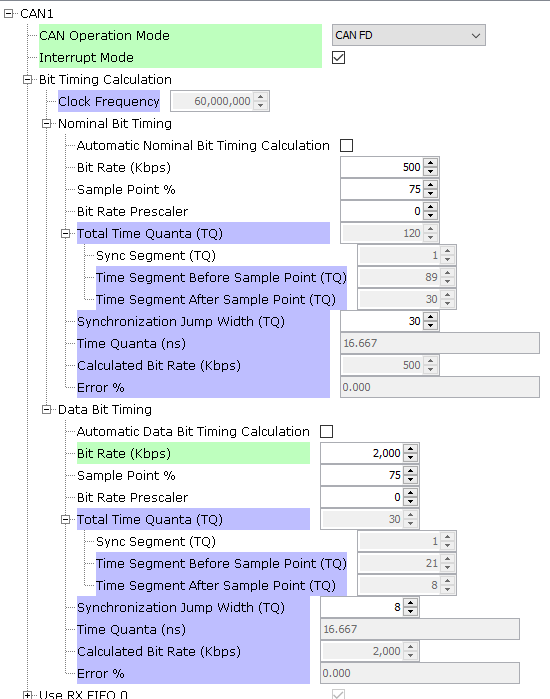
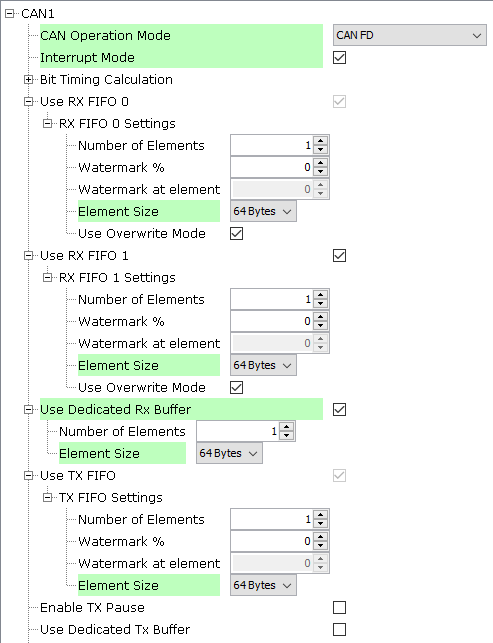
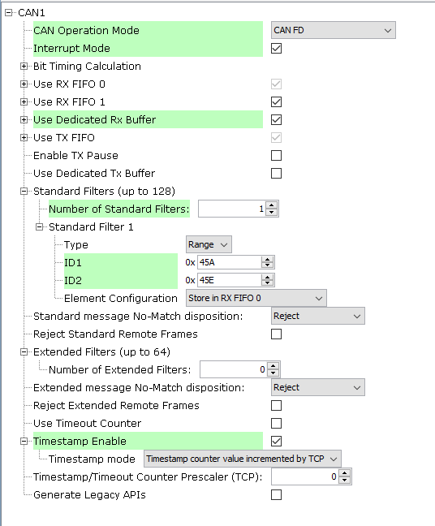
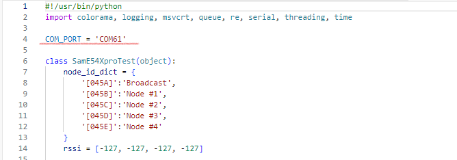

# CAN Sniffer for Debugging/Logging (004_sniffer)


## Setup

The CAN Sniffer application is implemented on a SAME54 Xplained Pro.  
The MPLAB&reg; X IDE Project can be found under [apps/004_sniffer/firmware/SAME54_XPRO_TEST.X](firmware/SAME54_XPRO_TEST.X)  
The Hex file is available under [hex/SAME54_XPRO_CANSniffer.hex.hex](../../hex/SAME54_XPRO_CANSniffer.hex.hex)

The software has been created and tested with the following Software Development Tools:
- [MPLAB&reg; X IDE 6.25](https://www.microchip.com/en-us/development-tools-tools-and-software/mplab-x-ide)
- [MPLAB&reg; XC32 v4.60](https://www.microchip.com/en-us/development-tools-tools-and-software/mplab-xc-compilers)
- [MPLAB&reg; Code Configurator v5.5.1](https://www.microchip.com/en-us/tools-resources/configure/mplab-code-configurator)
  - [csp v3.19.6](https://github.com/Microchip-MPLAB-Harmony/csp/tree/v3.19.6)
  - [core v3.13.5](https://github.com/Microchip-MPLAB-Harmony/core/tree/v3.13.5)
  - [CMSIS_5 5.9.0](https://github.com/Microchip-MPLAB-Harmony/wireless_ble/tree/v1.3.0)
  - [CMSIS-FreeRTOS v10.5.1](https://github.com/Microchip-MPLAB-Harmony/CMSIS-FreeRTOS/tree/v10.5.1)
- Packs:
  - [SAME54_DFP v3.8.234](https://packs.download.microchip.com/)

## Harmony Configuration
### Project Graph


### Pin Diagram and Settings
  



### USART Setting (for configuration and debug purpose)


### CAN1 Setting (for CAN communication)


#### CAN1 - Bit Timing Calculation


#### CAN1 - FIFO Settings


#### CAN1 - Filter Settings


## Run the Sniffer
1. Change the COM Port in script [can_sniffer.py](../../tools/can_sniffer/src/can_sniffer.py)

2. Run the script [can_sniffer.py](../../tools/can_sniffer/src/can_sniffer.py)
   ```
   cd tools/can_sniffer/src
   py -3 src/can_sniffer.py
   ```


[back](../../README.md/#software-setup)